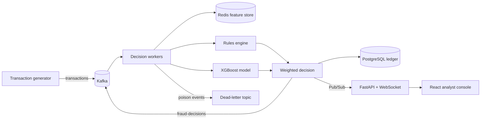

# FraudStream

FraudStream is a streaming reference implementation for making fraud decisions on a live payment stream. It turns synthetic transaction events into point-in-time customer features, combines an explainable rules engine with an XGBoost classifier, records every decision, and streams high-risk payments to an analyst dashboard.


## System flow



## Current validation boundary

Transactions and training labels are synthetic. The default scorer uses a deterministic fallback when no trained model artifact exists; XGBoost training is a separate step.

The [Redis feature pipeline](backend/app/features.py) reads and updates state in separate transactions, and the [worker](backend/app/worker.py) updates features before persisting a decision. Concurrent processing and replay can therefore affect feature history. These paths need atomic updates, replay protection, and failure tests before production use. No throughput or live fraud-reduction result is claimed.

## What it demonstrates

- Kafka consumers with manual offset commits, stable customer partition keys, idempotent production, and a dead-letter topic
- A bounded, validated Go ingestion gateway for high-throughput transaction producers
- Redis-backed online features: one-minute/hour velocity, historical amount z-score, device novelty, country change, and geographic distance
- Explainable policy rules combined with an XGBoost probability score
- PostgreSQL decision ledger and labeled evaluation snapshots
- Precision, recall, F1, false-positive rate, decision latency, and population stability index (PSI) drift monitoring
- JWT-protected REST endpoints and WebSocket live decisions
- Responsive React/TypeScript analyst dashboard
- Docker Compose, Kubernetes autoscaling, AWS infrastructure examples, and GitHub Actions

## Run it

Requirements: Docker Desktop with at least 6 GB available.

```bash
cp .env.example .env
docker compose up --build
```

Open [http://localhost:3000](http://localhost:3000). The simulator generates 25 events per second by default. The system uses a deterministic fallback score until a trained artifact is mounted.

Train the bundled XGBoost model locally:

```bash
python -m venv .venv && source .venv/bin/activate
pip install -e '.[dev]'
PYTHONPATH=backend python -m app.train --output models/fraud_model.joblib
```

Then rebuild the worker. Generate a monitoring snapshot after at least 100 labeled simulator decisions:

```bash
docker compose exec worker python -m app.evaluate
```

## Decision behavior

The rules engine adds independent risk signals for velocity, unusual spend, impossible travel, a new device making a high-value purchase, and a country change. The final score weights rules at 40% and XGBoost at 60%. A transaction is flagged above `DECISION_THRESHOLD`, or when deterministic rules alone reach 0.70.

The synthetic `is_fraud` label exists only for offline evaluation. It is never included in online feature calculation or scoring. Kafka keys all transactions by user so a user's events remain ordered within a partition. Production systems should additionally use a feature registry, event-time watermarks, schema compatibility checks, and a governed model registry.

## API

| Endpoint | Purpose |
|---|---|
| `POST /api/auth/demo` | Issue an eight-hour demo analyst token |
| `GET /api/overview` | Operational and latest model metrics |
| `GET /api/decisions` | Search/filter the decision ledger |
| `WS /ws/decisions?token=…` | Stream scored transactions |
| `GET /metrics` | Prometheus scrape endpoint |
| `GET /health` | Container health probe |

Interactive API documentation is available at [http://localhost:8000/docs](http://localhost:8000/docs).

## Scale and reliability

Decision workers can scale horizontally. Kafka partitions bound useful parallelism, while keyed events maintain per-customer order. Redis pipelines update short-lived online state. PostgreSQL is the audit ledger rather than the hot feature path. Consumers commit only after the decision is stored and republished; `transaction_id` is unique, allowing replay deduplication. See [Architecture](docs/architecture.md) and [Deployment](docs/deployment.md).

## Honest limitations

- The generator is synthetic and the included trainer learns synthetic patterns; neither is a production fraud model.
- The Redis read/compute/write sequence is pipelined but not protected by a Lua script. A production system should use Lua or a stream processor for strict atomicity under concurrent processing of the same key.
- Authentication demonstrates signed JWT enforcement but omits enterprise identity, key rotation, and granular case permissions.
- PSI watches amount distribution only. Production monitoring should cover every feature, slice metrics, calibration, label delay, and concept drift.
- This reference flags decisions for review. It must not be used to deny payments or make high-impact decisions without validation, human oversight, fairness testing, and local legal review.

## Repository layout

```text
backend/app/       API, generator, online features, worker, training, evaluation
backend/tests/     scoring and geospatial unit tests
ingest/            Go HTTP-to-Kafka ingestion gateway
frontend/          React/TypeScript analyst console
infra/k8s/         Kubernetes workloads and autoscaling
infra/terraform/   AWS MSK, RDS, ElastiCache, and S3 example
docs/              architecture, deployment, and model card
```

Licensed under MIT.
